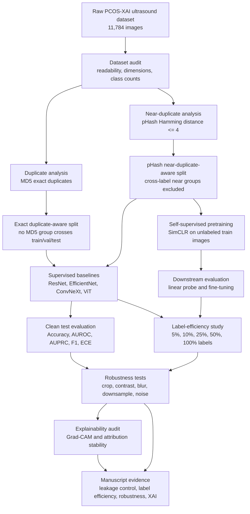

# Self-Supervised Learning for Low-Cleanliness PCOS Ultrasound Classification

Living research notebook for a PyTorch/MPS study on PCOS ultrasound classification using the Kaggle PCOS-XAI Ultrasound dataset.

Dataset source: <https://www.kaggle.com/datasets/ibadeus/pcos-xai-ultrasound-dataset/data>

Companion research notes:

- [Experiment ledger](docs/EXPERIMENTS.md)
- [Decision log](docs/DECISIONS.md)
- [Manuscript notes](docs/MANUSCRIPT_NOTES.md)

## Research Goal

Develop and evaluate self-supervised learning methods that can learn useful ovarian ultrasound representations from a noisy, duplicate-heavy, mixed-quality PCOS dataset, then fine-tune those representations for PCOS vs healthy ovary classification under leakage-controlled evaluation.

The key claim we want to test:

> Self-supervised pretraining can improve PCOS ultrasound classification when labels are limited or data cleanliness is poor, but only if evaluation prevents duplicate leakage and artifact shortcuts.

## Working Paper Idea

**Possible title**

Beyond Clean Data: Self-Supervised Representation Learning for PCOS Ultrasound Classification Under Duplicate-Aware Evaluation

**Core contribution**

1. A duplicate-aware experimental protocol for the PCOS-XAI ultrasound dataset.
2. A comparison of supervised transfer learning against self-supervised pretraining.
3. A label-efficiency study using 5%, 10%, 25%, 50%, and 100% of training labels.
4. A robustness and explainability audit to test whether models learn ovarian morphology or dataset artifacts.
5. A reproducible Apple Silicon PyTorch/MPS training workflow for local medical imaging research.

## Dataset Snapshot

Local dataset path:

```text
./PCOS
```

Class folders:

| Class folder | Meaning | Local count |
|---|---:|---:|
| `PCOS/infected` | PCOS-positive ovarian ultrasound | 6,784 |
| `PCOS/noninfected` | Healthy/non-PCOS ovarian ultrasound | 5,000 |
| Total | Binary classification dataset | 11,784 |

Known dataset issues from local inspection:

| Issue | Current finding |
|---|---:|
| Class imbalance | 6,784 vs 5,000 |
| Exact duplicate groups | 1,956 |
| Duplicate files beyond first copy | 7,788 |
| Cross-class exact duplicate groups | 0 |
| pHash near-duplicate groups | 1,788 |
| pHash near-duplicate files beyond first | 9,448 |
| Cross-class pHash near-duplicate groups | 38 |
| Mixed naming conventions | Yes |
| Mixed preprocessing/resolution | Expected; needs full audit |

## Why This Can Be Q1-Level

Most PCOS ultrasound papers report high accuracy on public datasets, but many do not sufficiently control for duplicated images, near-duplicates, preprocessing artifacts, or label-efficient generalization. This project focuses on trustworthy methodology rather than only a higher score.

The novelty is not simply "use SimCLR on PCOS." The novelty is:

- self-supervised learning under low-cleanliness medical image conditions,
- duplicate-aware train/validation/test splitting,
- label-efficiency evaluation,
- artifact and explanation robustness checks,
- transparent reporting of failed methods and leakage-sensitive results.

## Hardware and Framework Plan

Primary machine:

- Apple Silicon M-series device with unified CPU/GPU memory
- PyTorch using `mps` backend when available
- CPU fallback for unsupported operations

Expected device selection logic:

```python
import torch

if torch.backends.mps.is_available():
    device = torch.device("mps")
else:
    device = torch.device("cpu")
```

Important notes:

- MPS can accelerate many CNN/ViT workloads, but not all PyTorch operators are equally optimized.
- Batch size must be tuned empirically.
- Mixed precision may be useful, but should be tested carefully for stability.
- All timing and memory results should record whether training used `mps` or `cpu`.

## Main Research Questions

1. Does self-supervised pretraining improve PCOS ultrasound classification compared with ImageNet-supervised transfer learning?
2. Does SSL help more when only a small percentage of labels are available?
3. How much does duplicate leakage inflate reported accuracy?
4. Which SSL method is most stable on noisy ovarian ultrasound images?
5. Do SSL-trained models produce more anatomically meaningful explanations?
6. Are the learned models robust to resolution, crop, contrast, and artifact changes?

## Methodology Flowchart



## Experimental Design

### Phase 1: Dataset Audit

Tasks:

- Count images per class.
- Validate readable image files.
- Record image dimensions and color modes.
- Detect exact duplicates with file hashes.
- Detect near-duplicates with perceptual hashes and/or embedding similarity.
- Assign duplicate group IDs.
- Create leakage-safe train/validation/test splits where duplicate groups do not cross splits.

Deliverables:

- `metadata/images.csv`
- `metadata/duplicate_groups.csv`
- `metadata/splits_duplicate_aware.csv`
- Dataset audit table for paper.

Status:

- [x] Counted class folders.
- [x] Found exact duplicate groups with MD5.
- [x] Audit dimensions and image modes.
- [x] Detect pHash near-duplicates.
- [x] Build exact duplicate-aware split files.
- [x] Build pHash near-duplicate-aware split files.

### Phase 2: Baseline Supervised Models

Train standard supervised baselines using duplicate-aware splits.

Candidate models:

- ResNet-18
- EfficientNet-B0/B2
- MobileNetV3
- ConvNeXt-Tiny
- ViT-Tiny or ViT-Small

Evaluation metrics:

- Accuracy
- Balanced accuracy
- AUROC
- AUPRC
- Sensitivity/recall for PCOS-positive class
- Specificity
- F1-score
- Expected calibration error
- Confusion matrix

Status:

- [x] Implement supervised training pipeline.
- [x] Implement metrics.
- [x] Train first supervised baseline.
- [x] Run MPS smoke test.
- [x] Save first full baseline result table.

### Phase 3: Self-Supervised Pretraining

Train SSL encoders using all training images without labels.

Candidate methods, in order:

1. SimCLR
2. BYOL
3. DINO-style self-distillation
4. Masked autoencoder if compute allows

Initial recommendation:

Start with SimCLR because it is simpler, transparent, and easier to debug on Apple Silicon. Then move to BYOL or DINO if SimCLR is stable.

Pretraining augmentations:

- Random resized crop
- Horizontal flip where clinically reasonable
- Mild rotation
- Brightness/contrast jitter
- Gaussian blur
- Speckle/noise simulation
- No aggressive transformations that destroy ovarian morphology

Status:

- [x] Implement SSL dataset loader.
- [x] Implement SimCLR pretraining.
- [x] Run small MPS smoke test.
- [x] Run full SimCLR pretraining.
- [x] Save encoder checkpoint.
- [ ] Try BYOL.
- [ ] Try DINO/ViT if feasible.

### Phase 4: Label-Efficiency Fine-Tuning

Fine-tune pretrained encoders using different label budgets.

Label budgets:

| Label budget | Supervised ImageNet baseline | SSL encoder | Notes |
|---:|---|---|---|
| 5% | ResNet-18: acc 0.8106, AUROC 0.9734 | SimCLR e25 full fine-tune: acc 0.5595, AUROC 0.9367 | SSL rank signal exists, threshold behavior poor after one fine-tune epoch |
| 10% | ResNet-18: acc 0.9427, AUROC 0.9930 | SimCLR e25 full fine-tune: acc 0.9308, AUROC 0.9711 | SSL accuracy close, AUROC below supervised |
| 25% | ResNet-18: acc 0.9320, AUROC 0.9937 | SimCLR e25 full fine-tune: acc 0.9138, AUROC 0.9878 | SSL trails supervised in first pass |
| 50% | ResNet-18: acc 0.9843, AUROC 0.9992 | SimCLR e25 full fine-tune: acc 0.9484, AUROC 0.9893 | Supervised still stronger after one epoch |
| 100% | Pending | Pending | Full-label comparison |

Fine-tuning modes:

- Linear probe: freeze encoder, train classifier head.
- Partial fine-tune: unfreeze final block.
- Full fine-tune: train entire model.

Status:

- [ ] Create label-budget split generator.
- [ ] Run linear-probe experiments.
- [ ] Run partial fine-tuning experiments.
- [x] Run first full fine-tuning experiments.

### Phase 5: Robustness and Artifact Tests

Stress-test trained models with controlled image changes.

Tests:

- Center crop vs full image.
- Aspect-preserving resize vs square resize.
- Border masking.
- Contrast shift.
- Noise/speckle shift.
- Resolution downsampling.
- Duplicate-free external-like split if possible.

Status:

- [x] Implement test-time corruption suite.
- [x] Compare supervised vs SSL robustness.
- [x] Create first robustness result table.

### Phase 6: Explainability Audit

Check whether models attend to clinically plausible regions.

Methods:

- Grad-CAM
- Score-CAM if feasible
- Eigen-CAM
- Occlusion sensitivity
- Explanation stability across duplicate/near-duplicate groups

Evaluation:

- Visual inspection grid.
- Attribution shift after artifact masking.
- Sanity checks with randomized model weights.
- Compare supervised vs SSL explanations.

Status:

- [ ] Implement Grad-CAM pipeline.
- [ ] Generate explanation samples.
- [ ] Run explanation stability tests.
- [ ] Document failure cases.

## Planned Repository Structure

Target structure:

```text
.
├── README.md
├── PCOS/
│   ├── infected/
│   └── noninfected/
├── metadata/
│   ├── images.csv
│   ├── duplicate_groups.csv
│   └── splits_duplicate_aware.csv
├── src/
│   ├── data/
│   ├── models/
│   ├── ssl/
│   ├── train_supervised.py
│   ├── train_ssl.py
│   ├── finetune.py
│   └── evaluate.py
├── configs/
├── checkpoints/
├── runs/
└── reports/
```

Generated files such as checkpoints, logs, and large result artifacts should not be committed unless we intentionally decide to version them.

## Experiment Log

Use this section after every experiment. Keep failures. They are valuable for the final paper.

### 2026-05-21: Initial Dataset Inspection

**Goal**

Confirm local dataset availability and basic class counts.

**Result**

- Found `PCOS/infected` and `PCOS/noninfected`.
- Counted 11,784 total images.
- Found 1,956 exact duplicate groups using MD5.
- Found 7,788 duplicate files beyond the first copy.
- Found 0 exact duplicate groups crossing class folders.

**Interpretation**

Duplicate-aware splitting is mandatory. A random split will likely overestimate model performance because visually identical samples can appear in both training and test sets.

**Next action**

Create metadata generation script for image audit and duplicate grouping.

### 2026-05-21: Project Scaffold, Audit Scripts, and MPS Smoke Test

**Goal**

Create a working PyTorch/MPS project foundation using `uv`, then verify that the code can audit data, create leakage-safe splits, and run a supervised training step on Apple Silicon GPU.

**Files created**

- `pyproject.toml`
- `uv.lock`
- `configs/baseline.yaml`
- `scripts/check_runtime.py`
- `scripts/audit_dataset.py`
- `scripts/make_splits.py`
- `scripts/train_supervised.py`
- `src/pcos_ssl/`
- `metadata/images.csv`
- `metadata/duplicate_groups.csv`
- `metadata/splits_duplicate_aware.csv`

**Result**

- Installed/locked PyTorch, torchvision, timm, pandas, scikit-learn, OpenCV, Pillow/imagehash, matplotlib, seaborn, tqdm, rich, and PyYAML.
- Verified runtime: `torch=2.12.0`, `device=mps`, `mps_available=True`, `cpu_threads=18`.
- Audited all 11,784 images successfully with no unreadable files.
- Wrote exact duplicate metadata and duplicate-aware split CSVs.
- Ran a tiny supervised ResNet-18 smoke test on `mps`.

**Important caveat**

The smoke test used only 1-2 validation batches, so its metrics are not scientific. It only confirms that the training loop, data loader, model, and MPS device path work.

**Next action**

Run a real supervised baseline for at least ResNet-18 on the full duplicate-aware split, then run a longer SimCLR pretraining job.

### 2026-05-21: SimCLR Smoke Test

**Goal**

Verify the first self-supervised training path on Apple Silicon MPS.

**Result**

- Added `src/pcos_ssl/ssl/simclr.py`.
- Added `src/pcos_ssl/data/ssl_dataset.py`.
- Added `configs/simclr.yaml`.
- Added `scripts/train_simclr.py`.
- Ran `uv run python scripts/train_simclr.py --epochs 1 --max-train-batches 1 --output-dir runs/simclr_smoke`.
- Confirmed runtime: `torch=2.12.0`, `device=mps`, `cpu_threads=18`.
- One-batch smoke loss: `4.1280`.
- Wrote smoke checkpoint: `runs/simclr_smoke/encoder_last.pt`.

**Interpretation**

This is not a result for the paper. It confirms that the contrastive dataset, two-view augmentation pipeline, SimCLR model, NT-Xent loss, optimizer, and MPS training path all execute successfully.

**Next action**

Run real supervised baselines first, then launch SimCLR for enough epochs to compare downstream fine-tuning.

## Results Tracker

### Dataset Split Results

| Split strategy | Train | Validation | Test | Leakage control | Status |
|---|---:|---:|---:|---|---|
| Random image split | Pending | Pending | Pending | No | Not recommended except as leakage demonstration |
| Exact duplicate group split | 8,228 | 1,803 | 1,753 | Exact duplicates controlled | Done |
| Near-duplicate group split | Pending | Pending | Pending | Exact + near duplicates controlled | Planned |
| pHash near-duplicate group split | 7,429 | 1,584 | 1,589 | Exact + pHash near duplicates controlled; cross-label near groups excluded | Done |

### Model Results

| Experiment ID | Method | Backbone | Split | Label budget | Accuracy | AUROC | F1 | ECE | Notes |
|---|---|---|---|---:|---:|---:|---:|---:|---|
| resnet18-supervised-exact-e1 | Supervised | ResNet-18 | Exact duplicate-aware | 100% | 0.9960 | 0.9997 | 0.9964 | 0.0304 | One epoch; suspiciously high, needs near-duplicate benchmark |
| resnet18-supervised-phash-e1 | Supervised | ResNet-18 | pHash near-duplicate-aware | 100% | 0.9924 | 0.9994 | 0.9933 | 0.0183 | One epoch; still very high under stricter split |
| efficientnet-b0-supervised-phash-e1 | Supervised | EfficientNet-B0 | pHash near-duplicate-aware | 100% | 0.9635 | 0.9972 | 0.9681 | 0.0266 | Strong but below ResNet-18 after one epoch |
| vit-tiny-supervised-phash-e1 | Supervised | ViT-Tiny/16 | pHash near-duplicate-aware | 100% | 0.9421 | 0.9986 | 0.9457 | 0.0386 | High AUROC with conservative threshold behavior |
| convnext-tiny-supervised-phash-e1 | Supervised | ConvNeXt-Tiny | pHash near-duplicate-aware | 100% | 0.8269 | 0.9565 | 0.8227 | 0.0446 | Under-trained after one epoch |
| resnet18-supervised-phash-5pct-e1 | Supervised | ResNet-18 | pHash near-duplicate-aware | 5% | 0.8106 | 0.9734 | 0.7973 | 0.2356 | Low-label baseline |
| resnet18-supervised-phash-10pct-e1 | Supervised | ResNet-18 | pHash near-duplicate-aware | 10% | 0.9427 | 0.9930 | 0.9463 | 0.2901 | Strong ranking, poor calibration |
| resnet18-supervised-phash-25pct-e1 | Supervised | ResNet-18 | pHash near-duplicate-aware | 25% | 0.9320 | 0.9937 | 0.9356 | 0.0739 | Needs repeated seeds |
| resnet18-supervised-phash-50pct-e1 | Supervised | ResNet-18 | pHash near-duplicate-aware | 50% | 0.9843 | 0.9992 | 0.9858 | 0.0278 | Near full-label performance |
| smoke-001 | Supervised | ResNet-18 | Duplicate-aware | N/A | N/A | N/A | N/A | N/A | Runtime-only MPS smoke test; not a real result |
| smoke-002 | SimCLR | ResNet-18 | Duplicate-aware train split | N/A | N/A | N/A | N/A | N/A | One-batch MPS smoke test; loss 4.1280 |
| simclr-resnet18-phash-e1-linear-10pct-e1 | SimCLR + linear probe | ResNet-18 | pHash near-duplicate-aware | 10% | 0.6388 | 0.7781 | 0.5754 | 0.1055 | One-epoch SSL pretraining only; pipeline validation |
| simclr-resnet18-phash-e25-finetune-5pct-e1 | SimCLR + full fine-tune | ResNet-18 | pHash near-duplicate-aware | 5% | 0.5595 | 0.9367 | 0.3554 | 0.2145 | Longer SSL helps AUROC, but thresholded recall is poor |
| simclr-resnet18-phash-e25-finetune-10pct-e1 | SimCLR + full fine-tune | ResNet-18 | pHash near-duplicate-aware | 10% | 0.9308 | 0.9711 | 0.9344 | 0.2250 | Close accuracy to supervised 10%, lower AUROC |
| simclr-resnet18-phash-e25-finetune-25pct-e1 | SimCLR + full fine-tune | ResNet-18 | pHash near-duplicate-aware | 25% | 0.9138 | 0.9878 | 0.9169 | 0.0847 | Needs longer downstream tuning and repeated seeds |
| simclr-resnet18-phash-e25-finetune-50pct-e1 | SimCLR + full fine-tune | ResNet-18 | pHash near-duplicate-aware | 50% | 0.9484 | 0.9893 | 0.9519 | 0.0577 | Stronger than one-epoch SSL probe, below supervised 50% |

### Robustness Results

Checkpoint: `runs/resnet18_supervised_exact_e1/best_model.pt`

| Test condition | Accuracy | AUROC | F1 | ECE | Note |
|---|---:|---:|---:|---:|---|
| Clean resize | 0.9960 | 0.9997 | 0.9964 | 0.0304 | Main exact-duplicate-aware test result |
| Center crop | 0.7895 | 0.9788 | 0.8391 | 0.1372 | Large accuracy drop |
| Low contrast | 0.9606 | 0.9978 | 0.9656 | 0.0400 | Moderate drop |
| High contrast | 0.9663 | 0.9995 | 0.9686 | 0.0166 | Moderate drop |
| Blur | 0.5562 | 0.8800 | 0.7135 | 0.4153 | Severe preprocessing sensitivity |
| Downsample | 0.5562 | 0.8887 | 0.7135 | 0.4096 | Severe preprocessing sensitivity |
| Gaussian noise | 0.7427 | 0.9885 | 0.8112 | 0.1194 | Accuracy drop with high ranking performance |

### Cross-Model Robustness Snapshot

| Model | Clean acc | Blur acc | Downsample acc | Noise acc | Main note |
|---|---:|---:|---:|---:|---|
| ResNet-18 | 0.9924 | 0.5645 | 0.5670 | 0.7728 | Best clean accuracy, brittle to blur/downsample |
| EfficientNet-B0 | 0.9635 | 0.6589 | 0.7017 | 0.5746 | Strong clean AUROC, weak under noise |
| ViT-Tiny/16 | 0.9421 | 0.9836 | 0.9899 | 0.9239 | Most robust to blur/downsample |
| ConvNeXt-Tiny | 0.8269 | 0.8609 | 0.8571 | 0.8125 | Under-trained but stable |
| SimCLR ResNet-18 10% linear probe | 0.6388 | 0.5437 | 0.5538 | 0.6973 | Pipeline validation only |
| SimCLR ResNet-18 e25 50% fine-tune | 0.9484 | 0.5639 | 0.5670 | 0.8785 | Better noise robustness than supervised ResNet, still blur/downsample brittle |

### Validation-Selected Threshold Snapshot

Thresholds are selected on the validation split only, then locked before test evaluation. This is important because several one-epoch models rank cases well but are poorly aligned to the default 0.5 operating point.

| Experiment | Label budget | Default acc | Tuned acc | Default sensitivity | Tuned sensitivity | Tuned specificity | AUROC |
|---|---:|---:|---:|---:|---:|---:|---:|
| ResNet-18 supervised | 5% | 0.8106 | 0.9062 | 0.6629 | 0.9406 | 0.8621 | 0.9734 |
| ResNet-18 supervised | 10% | 0.9427 | 0.9654 | 0.8981 | 0.9474 | 0.9885 | 0.9930 |
| ResNet-18 supervised | 25% | 0.9320 | 0.9547 | 0.8791 | 0.9351 | 0.9799 | 0.9937 |
| ResNet-18 supervised | 50% | 0.9843 | 0.9899 | 0.9720 | 0.9821 | 1.0000 | 0.9992 |
| SimCLR e25 fine-tune | 5% | 0.5595 | 0.8156 | 0.2161 | 0.7413 | 0.9109 | 0.9367 |
| SimCLR e25 fine-tune | 10% | 0.9308 | 0.9534 | 0.8768 | 0.9171 | 1.0000 | 0.9711 |
| SimCLR e25 fine-tune | 25% | 0.9138 | 0.9572 | 0.8466 | 0.9395 | 0.9799 | 0.9878 |
| SimCLR e25 fine-tune | 50% | 0.9484 | 0.9597 | 0.9082 | 0.9283 | 1.0000 | 0.9893 |

### Repeated-Seed Snapshot

Seeds: 42, 7, and 123. All runs use one downstream epoch on the pHash near-duplicate-aware split.

| Method | Label budget | Accuracy mean +/- std | AUROC mean +/- std | Tuned accuracy mean +/- std | Tuned sensitivity mean |
|---|---:|---:|---:|---:|---:|
| SimCLR e25 fine-tune | 10% | 0.9366 +/- 0.0214 | 0.9784 +/- 0.0072 | 0.9392 +/- 0.0176 | 0.9201 |
| Supervised ResNet-18 | 10% | 0.9270 +/- 0.0137 | 0.9766 +/- 0.0153 | 0.9366 +/- 0.0249 | 0.9044 |
| SimCLR e25 fine-tune | 25% | 0.9211 +/- 0.0064 | 0.9859 +/- 0.0020 | 0.9452 +/- 0.0104 | 0.9332 |
| Supervised ResNet-18 | 25% | 0.9360 +/- 0.0058 | 0.9925 +/- 0.0044 | 0.9543 +/- 0.0245 | 0.9537 |

### Failed Attempts

| Date | Attempt | What failed | Likely reason | Decision |
|---|---|---|---|---|
| TBD | TBD | TBD | TBD | TBD |

## Methodology Notes for Paper

### Data Cleaning Policy

We should report results under multiple data conditions:

1. **Raw random split**: included only to show how leakage inflates results.
2. **Exact duplicate-aware split**: main minimum-valid benchmark.
3. **Near-duplicate-aware split**: strongest benchmark if near-duplicate detection is reliable.
4. **Cleaned training set**: optional ablation to compare raw SSL pretraining vs cleaned SSL pretraining.

### Statistical Reporting

Each important experiment should run with at least 3 random seeds if time allows.

Report:

- mean and standard deviation,
- confidence intervals for AUROC if feasible,
- McNemar or bootstrap comparison for best supervised vs SSL model,
- calibration plots for final models.

### Reproducibility Rules

Every experiment should record:

- Git commit or code snapshot,
- config file,
- random seed,
- device: `mps` or `cpu`,
- PyTorch version,
- image size,
- batch size,
- optimizer and learning rate,
- train/validation/test split file,
- checkpoint path,
- metrics JSON path.

## Immediate TODO

1. [x] Create a Python environment with PyTorch, torchvision, timm, pandas, scikit-learn, matplotlib, seaborn, and OpenCV/Pillow.
2. [x] Create metadata audit script.
3. [x] Generate exact duplicate groups.
4. [x] Generate duplicate-aware train/validation/test split.
5. [x] Implement supervised baseline.
6. [x] Train ResNet-18, EfficientNet-B0, ViT-Tiny, and ConvNeXt-Tiny baselines.
7. [x] Implement SimCLR pretraining.
8. [x] Run SimCLR smoke test on a small subset.
9. [x] Run full SimCLR pretraining.
10. [ ] Fine-tune SSL encoder under 5%, 10%, 25%, 50%, and 100% labels.
11. [x] Compare against supervised baselines.
12. [ ] Add robustness and XAI analysis.

## Current Decision Log

| Date | Decision | Reason |
|---|---|---|
| 2026-05-21 | Use self-supervised learning as main paper direction | More novel than plain CNN classification and well matched to noisy dataset |
| 2026-05-21 | Treat duplicates as central methodology issue | Local audit found 1,956 exact duplicate groups |
| 2026-05-21 | Start with SimCLR before BYOL/DINO | Simpler to debug and easier to explain |
| 2026-05-21 | Use duplicate-aware split as main benchmark | Prevents inflated test performance |
| 2026-05-21 | Keep raw dataset and Grad-CAM image derivatives out of GitHub | Avoid publishing Kaggle image files or visual derivatives |
| 2026-05-21 | Add pHash near-duplicate split as stricter benchmark | pHash threshold 4 found 38 cross-label near-duplicate groups |

## Notes to Update Later

- Add actual image resolution distribution.
- Add example images and duplicate examples.
- Add first baseline confusion matrix.
- Add training curves.
- Add SSL embedding visualizations with UMAP/t-SNE.
- Add Grad-CAM examples.
- Add paper outline after first complete result table.
